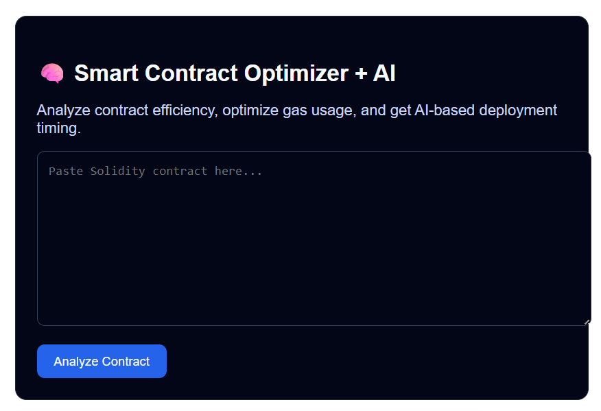
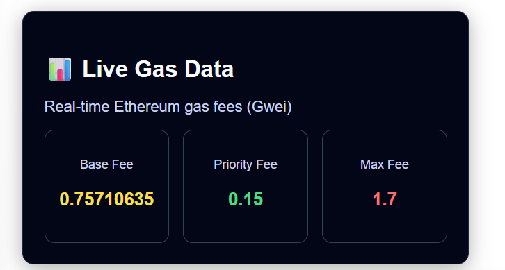
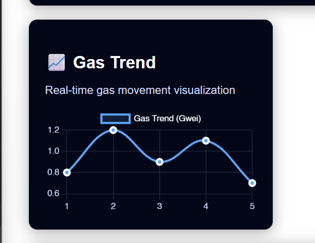

# 🚀 Adaptive AI-Based Gas Fee Optimization System
video tut https://youtu.be/CJ4WsGKsfu4?si=ps9xMDQ7Oc-olJKA
A hybrid system that combines **smart contract optimization** and **AI-based gas prediction** to reduce Ethereum transaction costs and improve execution efficiency.

---



## 🧠 Overview

Gas fees in Ethereum depend on:
- Smart contract efficiency  
- Network congestion  

Most solutions address these separately.

👉 This project introduces a **novel hybrid approach**:
- 🔍 Analyze contracts → detect inefficiencies  
- 🤖 Predict gas → using LSTM model  
- ⚡ Recommend execution → “Deploy” or “Wait”  

---

## 🔥 Features

### 🧾 Smart Contract Analyzer
- Detects:
  - Dynamic arrays
  - Unoptimized loops
  - Excess storage usage
- Suggests gas-efficient improvements

---

### 🤖 AI Gas Prediction
- Uses **LSTM model**
- Inputs:
  - Base fee  
  - Priority fee  
  - Historical trends  
- Outputs:
  - Predicted gas value  
  - Execution decision  

---

### 📊 Live Gas Dashboard
- Real-time gas data (Blocknative API)
- Auto-refresh every 10 seconds
- Visual indicators (low / medium / high gas)

---

### 📈 Visualization
- Gas trend chart
- AI prediction insights
- Clean dashboard UI

---

### ⚡ Transaction Execution
- Connects with MetaMask
- Executes contract functions
- Displays transaction hash

---

## 🏗️ Architecture
User Input Contract
↓
Contract Analyzer (Rule-based)
↓
Gas Data (API) → LSTM Model
↓
Prediction Engine
↓
Decision: Deploy / Wait
↓
Frontend Dashboard + Web3 Execution

---

## 🛠️ Tech Stack

### Frontend
- React.js
- Chart.js
- Axios

### Backend
- Flask (Python)
- LSTM Model (TensorFlow / NumPy / Pandas)

### Blockchain
- Ethereum (Sepolia)
- Ethers.js
- MetaMask

---

## 📂 Project Structure
project/
│
├── frontend/
│   ├── components/
│   │   ├── ContractAnalyzer.js
│   │   ├── GasPanel.js
│   │   ├── PredictionPanel.js
│   │   ├── GasChart.js
│   │   └── ExecuteButton.js
│   └── App.js
│
├── backend/
│   ├── api.py
│   ├── lstm_model.py
│   ├── gas_collector.py
│   ├── optimizer.py
│   └── gas_data.csv
│
└── README.md
---## ⚙️ Setup Instructions### 1️⃣ Clone the repository```bashgit clone https://github.com/your-username/project-name.gitcd project-name

2️⃣ Backend Setup (Python 3.10 recommended)
cd backendpip install flask flask-cors numpy pandas tensorflowpython api.py

3️⃣ Frontend Setup
cd frontendnpm installnpm start

4️⃣ Run Application


Backend → http://127.0.0.1:5000


Frontend → http://localhost:3000


📊 Example Workflow


Paste smart contract


Click Analyze


System:


detects inefficiencies


predicts gas


Output:


optimized suggestions


AI decision


Execute transaction (if optimal)


📚 Research Contribution
This project combines:


Smart contract optimization


Gas prediction using AI


Hybrid decision system


🔥 Novelty
Most works focus on:


optimization ❌ OR prediction ❌


👉 This system combines:
Optimization + Prediction + Execution

📖 References


Smart Contract Optimization (Kuhlman et al.)


Gas Fee Prediction using AI (Olasehinde)


GasAgent Multi-Agent Framework


Gas Estimation & Optimization (Li)


GASOL Optimization Framework


🚀 Future Work


Reinforcement Learning for better prediction


Real-time blockchain data integration


Auto contract rewriting


Deployment on mainnet


🧑‍💻 Author
Chirag Mehta
LNMIIT Jaipur

